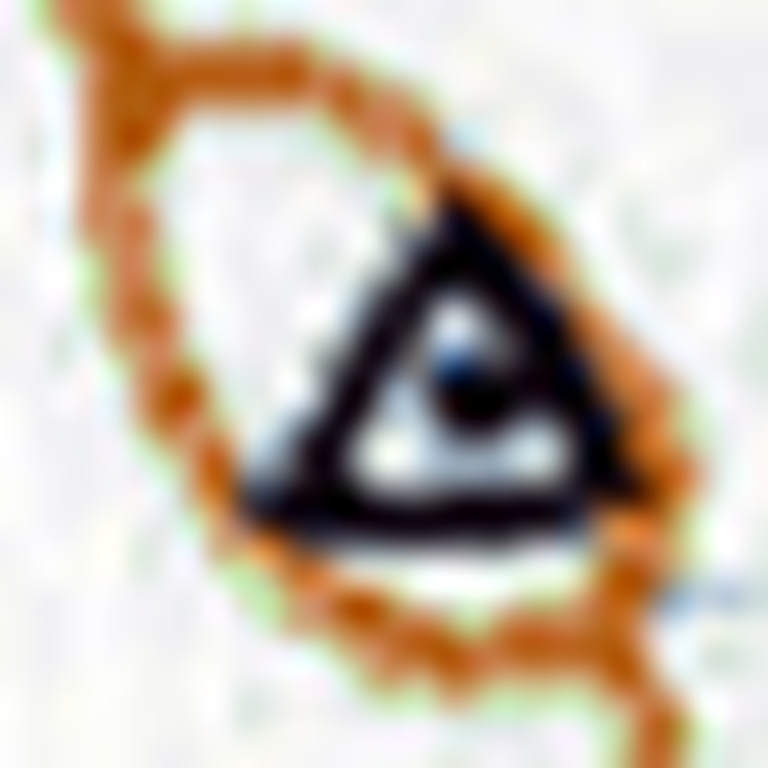
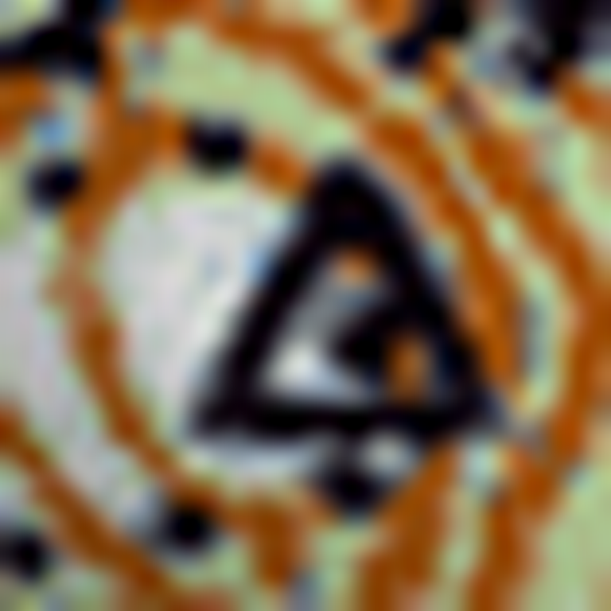
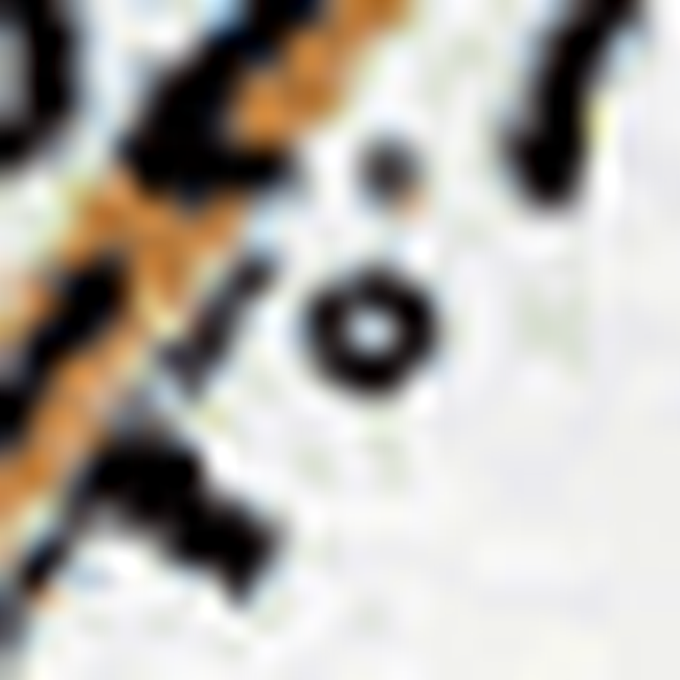
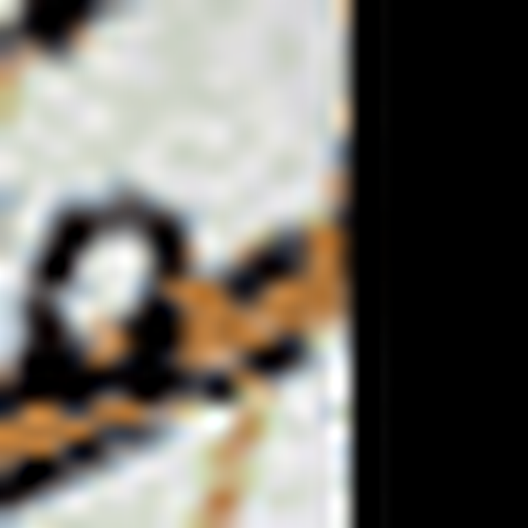
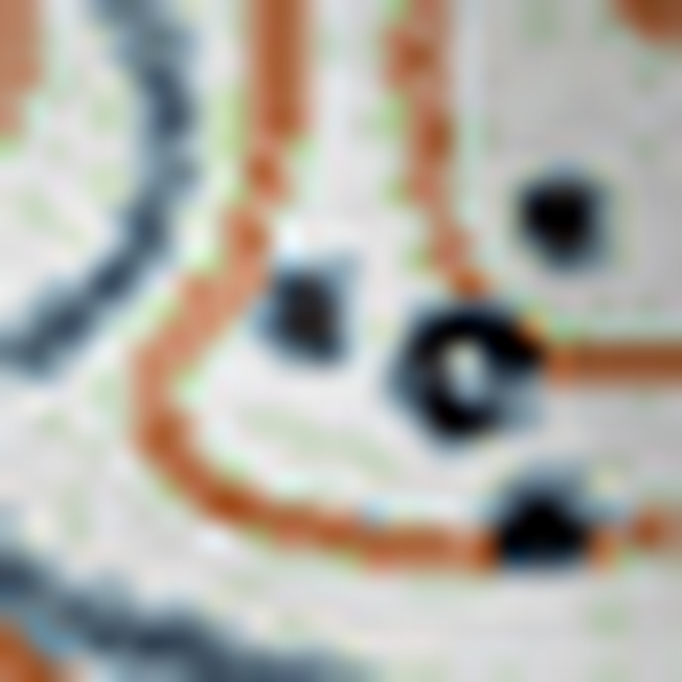

# GS-side strict (>125 m) FP-side burial-mound review

**Purpose**: visual inspection of the six Gold Standard (GS)-side false positives that the v2 burial-mound FP-classifier labelled as `burial-mound` or `triangulation-point-on-burial-mound` at the strictest distance stratum (> 125 m from any curator ground-truth (GT) mound). See `results/gs-fp-classification/report.md` line 25 for the headline framing ("6 / 14 = 42.9 %").

**For each candidate, record one verdict**:

- `real_mound_curator_omission` — this is a real mound; curator GT is incomplete here.
- `v2_overclaim` — v2 classifier is wrong; not a mound.
- `edge_case_ambiguous` — reasonable people could disagree.

Crop view: 150 m × 150 m metric window, upscaled to 768 px (matches the exact view the v2 classifier saw). Centroid is the centre pixel.

---

## Per-sheet context

| Sheet | Curator GT | Classified detns | TP-side @ 50 m | FP-side @ > 125 m |
|---|---:|---:|---:|---:|
| K-35-052-4_32635 | 136 | 89 | 81 | 6 |
| K-35-053-3_Elenovo | 217 | 128 | 123 | 5 |
| K-35-062-2_Rakovski | 196 | 143 | 143 | 0 |
| K-35-078-1_Lesovo | 20 | 11 | 8 | 3 |

Note: "TP-side @ 50 m" = detections within 50 m of any curator GT mound (a proxy for true positive (TP), not a strict TP per the IoU-based evaluators). "FP-side @ > 125 m" is the strict-stratum FP set this review draws from.

---

## Candidates

### 1. cand 54 — K-35-052-4_32635 — `triangulation-point-on-burial-mound`



**Context**:

- candidate ID: `54`
- sheet: `K-35-052-4_32635`
- centroid (EPSG:32635): (400261.840, 4688369.548)
- source tile: `K-35-052-4_32635_x336_y3360.png`
- distance to nearest curator GT mound: **2921.7 m**
- v2 label: **`triangulation-point-on-burial-mound`**
- v2 classifier confidence: 0.95
- v2 classifier rationale: "The image clearly shows a black triangulation triangle symbol centered within a brown oval burial-mound glyph."

**Verdict**:

```text
verdict: <real_mound_curator_omission | v2_overclaim | edge_case_ambiguous>
note: <optional one-liner>
```

---

### 2. cand 125 — K-35-052-4_32635 — `triangulation-point-on-burial-mound`



**Context**:

- candidate ID: `125`
- sheet: `K-35-052-4_32635`
- centroid (EPSG:32635): (400461.928, 4705726.964)
- source tile: `K-35-052-4_32635_x672_y0.png`
- distance to nearest curator GT mound: **1721.2 m**
- v2 label: **`triangulation-point-on-burial-mound`**
- v2 classifier confidence: 0.95
- v2 classifier rationale: "The image clearly shows a black triangulation triangle symbol centered within a small brown oval ring representing a burial mound."

**Verdict**:

```text
verdict: <real_mound_curator_omission | v2_overclaim | edge_case_ambiguous>
note: <optional one-liner>
```

---

### 3. cand 168 — K-35-053-3_Elenovo — `burial-mound`



**Context**:

- candidate ID: `168`
- sheet: `K-35-053-3_Elenovo`
- centroid (EPSG:32635): (418092.450, 4703273.975)
- source tile: `K-35-053-3_Elenovo_x0_y336.png`
- distance to nearest curator GT mound: **192.0 m**
- v2 label: **`burial-mound`**
- v2 classifier confidence: 0.95
- v2 classifier rationale: "The image shows a distinct, small brown ring symbol characteristic of a standard burial mound on Soviet topographic maps."

**Verdict**:

```text
verdict: <real_mound_curator_omission | v2_overclaim | edge_case_ambiguous>
note: <optional one-liner>
```

---

### 4. cand 349 — K-35-053-3_Elenovo — `burial-mound`



**Context**:

- candidate ID: `349`
- sheet: `K-35-053-3_Elenovo`
- centroid (EPSG:32635): (438088.794, 4690441.962)
- source tile: `K-35-053-3_Elenovo_x4032_y2688.png`
- distance to nearest curator GT mound: **427.7 m**
- v2 label: **`burial-mound`**
- v2 classifier confidence: 0.85
- v2 classifier rationale: "The image shows a small, discrete brown oval ring characteristic of the standard Soviet burial-mound symbol located near a contour line."

**Verdict**:

```text
verdict: <real_mound_curator_omission | v2_overclaim | edge_case_ambiguous>
note: <optional one-liner>
```

---

### 5. cand 531 — K-35-078-1_Lesovo — `triangulation-point-on-burial-mound`


**Context**:

- candidate ID: `531`
- sheet: `K-35-078-1_Lesovo`
- centroid (EPSG:32635): (462813.900, 4648119.138)
- source tile: `K-35-078-1_Lesovo_x672_y0.png`
- distance to nearest curator GT mound: **3385.0 m**
- v2 label: **`triangulation-point-on-burial-mound`**
- v2 classifier confidence: 0.95
- v2 classifier rationale: "The image shows a brown oval burial-mound symbol containing a black dot/triangle representing a triangulation marker."

**Verdict**:

```text
verdict: <real_mound_curator_omission | v2_overclaim | edge_case_ambiguous>
note: <optional one-liner>
```

---

### 6. cand 562 — K-35-078-1_Lesovo — `burial-mound`



**Context**:

- candidate ID: `562`
- sheet: `K-35-078-1_Lesovo`
- centroid (EPSG:32635): (461750.721, 4636452.434)
- source tile: `K-35-078-1_Lesovo_x336_y2352.png`
- distance to nearest curator GT mound: **2481.8 m**
- v2 label: **`burial-mound`**
- v2 classifier confidence: 0.9
- v2 classifier rationale: "The center of the image shows a distinct small brown ring symbol characteristic of a burial mound, situated near a contour line and vegetation markings."

**Verdict**:

```text
verdict: <real_mound_curator_omission | v2_overclaim | edge_case_ambiguous>
note: <optional one-liner>
```

---
