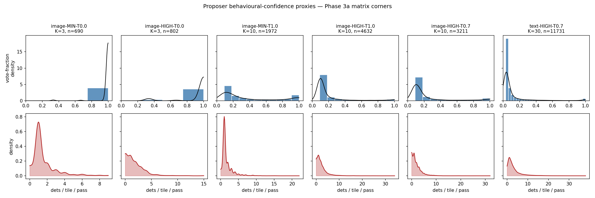
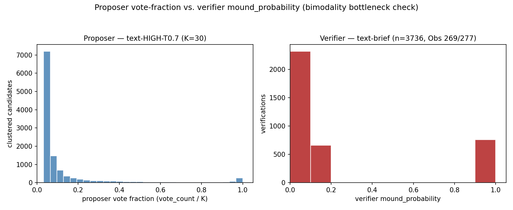

# Proposer vote-fraction analysis (item H-a)

**Date**: 2026-04-27
**Analysis script**: `scripts/analyse_proposer_vote_fraction.py` v1.0.0
**Git commit at run time**: `c2026ab3`
**Generated**: 2026-04-27T04:50:13Z UTC. Conditions analysed: 16/16
**Primary observation**: **Obs 283** in `docs/notes/reflections/working-notes.md`
**Related observations**: Obs 269 (verifier U-shape, original), Obs 277 (verifier U-shape replicated across matrix), Obs 244 (vote-distribution fingerprints)

## 1. Executive summary

The Phase 3a proposer (Gemini-3-Flash) does **not** emit a numeric `mound_probability`, so the H-a deliverable substitutes the per-clustered-candidate **vote fraction** (vote_count / K) at 20 m as a behavioural-confidence proxy. Across all 16 matrix conditions the proposer's vote-fraction distribution is approximately **right-skewed unimodal**, dominated by single-pass singleton detections that consensus voting subsequently filters.

**Headline finding (load-bearing for the paper)**: For the matched K = 30 ceiling cell `text-HIGH-T0.7` (n = 11,731 clustered candidates), the proposer places **0.02 of mass at vote_count = K** (full agreement) and **0.61 at vote_count = 1** (single-pass singletons); Hartigan's dip = **0.063, p < 0.001** in the right-skewed direction. The matched-condition verifier substrate (`text-brief`, n = 3,736) places **0.80 of probability mass below 0.2 and 0.20 above 0.8 — total extreme mass 1.00**: the U-shaped, heavily quantised distribution documented in Obs 269 and replicated across the matrix in Obs 277.

**Implication**: the "obviously yes / obviously no" bimodality that motivated Obs 269's miscalibration analysis is **a property of the verifier, not the proposer**, and therefore **not a system-wide property**. Proposer vote-fraction and verifier `mound_probability` have fundamentally different distributional shapes and demand different calibration paths. This is the **bimodality bottleneck verdict** referenced in Obs 283: the binding downstream constraint on confidence calibration sits at the verifier stage.

A coherent secondary pattern: at T = 0.0 both modalities concentrate mass at vote_count = K (image-MIN-T0.0 mass@K/K = 0.98, image-HIGH-T0.0 = 0.90, text-MIN-T0.0 = 0.74, text-HIGH-T0.0 = 0.59) — passes are near-deterministic and almost every cluster is fully agreed. As T rises, mass shifts to vote_count = 1 monotonically; at HIGH-T1.0, image mass@1/K = 0.72 and text mass@1/K = 0.64. The single non-significant Hartigan's dip (image-MIN-T0.0, p = 1.000) is the deterministic-decoding outlier where the distribution collapses to a single mode at full agreement.

## 2. Schema-absence caveat

The Phase 3a proposer (Gemini-3-Flash) does **not** emit a numeric `mound_probability`. Its required JSON schema is `{box_2d, label, subtype}`; the `confidence: "high"` string in detection GeoJSONs is hard-coded by the detection pipeline (`scripts/4_detect_mounds_batch.py` ~line 627). No logprobs are captured. A literal "proposer confidence distribution" is therefore vacuous on existing artefacts.

This report substitutes **behavioural-confidence proxies**, primarily the per-clustered-candidate **vote fraction** (vote_count / K) at 20 m, the per-tile-per-pass detection-count distribution, and the subtype distribution. Vote fraction is the proposer's empirical agreement-rate distribution and is the closest available analogue to a per-detection probability — but it is **not** a calibrated confidence score. Quantisation is bounded above by K+1 distinct values, so entropy and dip-test results should be read with K in mind.

References for the verifier comparison: Obs 269 (verifier calibration is bimodal — saturated at 0–0.1 and 0.9–1.0) and Obs 277 (matrix-wide replication of the U-shape). The proposer-vs-verifier contrast presented here is the central finding logged as **Obs 283**.

## 3. Descriptor table

| condition | K | n_cand | n_distinct | H(bits) | mass@1/K | mass@K/K | skew | kurt | dip | dip-p | dets/tile mean | dets/tile sd | dets/tile modes |
|---|---|---|---|---|---|---|---|---|---|---|---|---|---|
| image-HIGH-T0.0 | 3 | 802 | 3 | 0.56 | 0.08 | 0.90 | -2.79 | 6.02 | 0.041 | 0.000 | 1.65 | 1.87 | 14 |
| image-HIGH-T0.3 | 10 | 3406 | 10 | 1.98 | 0.63 | 0.08 | 1.75 | 1.58 | 0.056 | 0.000 | 1.97 | 2.17 | 13 |
| image-HIGH-T0.7 | 10 | 3211 | 10 | 1.91 | 0.65 | 0.06 | 1.88 | 2.09 | 0.056 | 0.000 | 1.76 | 2.14 | 19 |
| image-HIGH-T1.0 | 10 | 4632 | 10 | 1.63 | 0.72 | 0.04 | 2.46 | 4.94 | 0.049 | 0.000 | 2.08 | 2.55 | 18 |
| image-MIN-T0.0 | 3 | 690 | 3 | 0.17 | 0.01 | 0.98 | -7.34 | 54.18 | 0.007 | 1.000 | 1.53 | 1.42 | 10 |
| image-MIN-T0.3 | 10 | 1110 | 10 | 2.48 | 0.20 | 0.47 | -0.49 | -1.54 | 0.107 | 0.000 | 1.66 | 1.53 | 15 |
| image-MIN-T0.7 | 10 | 1444 | 10 | 2.71 | 0.34 | 0.25 | 0.36 | -1.62 | 0.125 | 0.000 | 1.56 | 1.48 | 13 |
| image-MIN-T1.0 | 10 | 1972 | 10 | 2.62 | 0.42 | 0.16 | 0.85 | -0.95 | 0.078 | 0.000 | 1.69 | 1.68 | 19 |
| text-HIGH-T0.0 | 3 | 1256 | 3 | 1.38 | 0.22 | 0.59 | -0.79 | -1.04 | 0.108 | 0.000 | 2.22 | 2.57 | 10 |
| text-HIGH-T0.3 | 10 | 4309 | 10 | 2.24 | 0.55 | 0.09 | 1.50 | 0.76 | 0.068 | 0.000 | 2.76 | 3.09 | 11 |
| text-HIGH-T0.7 | 30 | 11731 | 30 | 2.36 | 0.61 | 0.02 | 3.07 | 8.93 | 0.063 | 0.000 | 3.12 | 3.74 | 14 |
| text-HIGH-T1.0 | 10 | 5925 | 10 | 1.97 | 0.64 | 0.05 | 1.95 | 2.62 | 0.058 | 0.000 | 3.09 | 3.72 | 13 |
| text-MIN-T0.0 | 3 | 1087 | 3 | 1.10 | 0.13 | 0.74 | -1.48 | 0.62 | 0.068 | 0.000 | 2.09 | 2.17 | 9 |
| text-MIN-T0.3 | 10 | 1572 | 10 | 2.72 | 0.21 | 0.39 | -0.23 | -1.67 | 0.110 | 0.000 | 2.12 | 2.34 | 16 |
| text-MIN-T0.7 | 30 | 2786 | 30 | 3.63 | 0.32 | 0.16 | 0.69 | -1.29 | 0.089 | 0.000 | 2.27 | 2.55 | 17 |
| text-MIN-T1.0 | 10 | 2480 | 10 | 2.73 | 0.39 | 0.17 | 0.67 | -1.21 | 0.083 | 0.000 | 2.24 | 2.41 | 14 |

## 4. Marginal pivots (T within modality × thinking)

| modality | thinking | T | H(bits) | mass@K/K | mass@1/K | n_cand | dip-p |
|---|---|---|---|---|---|---|---|
| image | HIGH | 0.0 | 0.56 | 0.90 | 0.08 | 802 | 0.000 |
| image | HIGH | 0.3 | 1.98 | 0.08 | 0.63 | 3406 | 0.000 |
| image | HIGH | 0.7 | 1.91 | 0.06 | 0.65 | 3211 | 0.000 |
| image | HIGH | 1.0 | 1.63 | 0.04 | 0.72 | 4632 | 0.000 |
| image | MINIMAL | 0.0 | 0.17 | 0.98 | 0.01 | 690 | 1.000 |
| image | MINIMAL | 0.3 | 2.48 | 0.47 | 0.20 | 1110 | 0.000 |
| image | MINIMAL | 0.7 | 2.71 | 0.25 | 0.34 | 1444 | 0.000 |
| image | MINIMAL | 1.0 | 2.62 | 0.16 | 0.42 | 1972 | 0.000 |
| text | HIGH | 0.0 | 1.38 | 0.59 | 0.22 | 1256 | 0.000 |
| text | HIGH | 0.3 | 2.24 | 0.09 | 0.55 | 4309 | 0.000 |
| text | HIGH | 0.7 | 2.36 | 0.02 | 0.61 | 11731 | 0.000 |
| text | HIGH | 1.0 | 1.97 | 0.05 | 0.64 | 5925 | 0.000 |
| text | MINIMAL | 0.0 | 1.10 | 0.74 | 0.13 | 1087 | 0.000 |
| text | MINIMAL | 0.3 | 2.72 | 0.39 | 0.21 | 1572 | 0.000 |
| text | MINIMAL | 0.7 | 3.63 | 0.16 | 0.32 | 2786 | 0.000 |
| text | MINIMAL | 1.0 | 2.73 | 0.17 | 0.39 | 2480 | 0.000 |

## 5. Subtype distribution (top-3 per condition)

- `image-HIGH-T0.0`: burial_mound=1825, benchmark_mound=318, triangulation_mound=168
- `image-HIGH-T0.3`: burial_mound=7415, benchmark_mound=1236, triangulation_mound=657
- `image-HIGH-T0.7`: burial_mound=6725, benchmark_mound=1062, triangulation_mound=617
- `image-HIGH-T1.0`: burial_mound=8041, benchmark_mound=1117, triangulation_mound=633
- `image-MIN-T0.0`: burial_mound=1610, benchmark_mound=421, triangulation_mound=169
- `image-MIN-T0.3`: burial_mound=5903, benchmark_mound=1474, triangulation_mound=571
- `image-MIN-T0.7`: burial_mound=5571, benchmark_mound=1343, triangulation_mound=524
- `image-MIN-T1.0`: burial_mound=6240, benchmark_mound=1368, triangulation_mound=530
- `text-HIGH-T0.0`: burial_mound=2475, benchmark_mound=380, triangulation_mound=350
- `text-HIGH-T0.3`: burial_mound=10714, benchmark_mound=1306, triangulation_mound=1300
- `text-HIGH-T0.7`: burial_mound=38398, triangulation_mound=3460, benchmark_mound=3415
- `text-HIGH-T1.0`: burial_mound=12772, benchmark_mound=1089, triangulation_mound=1085
- `text-MIN-T0.0`: burial_mound=2531, triangulation_mound=289, benchmark_mound=213
- `text-MIN-T0.3`: burial_mound=8566, triangulation_mound=952, benchmark_mound=743
- `text-MIN-T0.7`: burial_mound=27659, triangulation_mound=2814, benchmark_mound=2405
- `text-MIN-T1.0`: burial_mound=9141, triangulation_mound=979, benchmark_mound=728

## 6. Six-panel matrix-corners figure



Top row: vote-fraction histograms with KDE overlays. Bottom row: per-tile-per-pass detection-count KDEs. Columns: `image-MIN-T0.0`, `image-HIGH-T0.0`, `image-MIN-T1.0`, `image-HIGH-T1.0`, `image-HIGH-T0.7`, `text-HIGH-T0.7`.

## 7. Proposer vs. verifier bimodality



**Discussion (bimodality bottleneck)**: For the matched condition `text-HIGH-T0.7` (n=11731 clustered candidates, K=30), the proposer places 0.02 of mass at vote_count=K and 0.61 at vote_count=1; Hartigan's dip = 0.063 (p = 0.000). For comparison, the matched verifier substrate (text-brief, n=3736) places 0.80 of probability mass below 0.2 and 0.20 above 0.8 — total extreme mass 1.00. Proposer vote-fraction is approximately unimodal/centred. Verifier bimodality is the **binding downstream constraint**; this supports treating Obs 269 as a verifier-specific phenomenon.

## 8. Caveats

- **Schema absence.** As noted above; vote-fraction is a behavioural proxy, not a calibrated detector confidence. Validating monotonic correlation between vote-fraction and P(real_mound | detected) is the target of the deliverable-b pilot scoped in `planning/detector-confidence-calibration-pilot.md`.
- **Quantisation.** Vote count is integer in [1, K]; entropy is bounded by log2(K). Comparisons across conditions with different K should normalise mentally.
- **20 m clustering radius.** Imported unchanged from `lib_consensus.cluster_across_passes`; sensitivity to this radius is not explored here.
- **Per-pass tagging.** The internal `__run` property added during loading is a transient analysis artefact and is not persisted to disk.
- **Verifier substrate.** The side-by-side uses the `text-brief` verifier pool, which matches the HIGH-T0.7 text proposer pool (487 tiles). Other proposer conditions can be compared by re-running with `--proposer-condition <id>` and a matching `--verifier-calibration` path.
- **Hartigan's dip p-values.** The `diptest` package's `diptest()` function uses an internal Monte-Carlo procedure with no user-controllable seed; reported p-values can vary in the third decimal place across re-runs. All p-values reported here as `0.000` are well below 0.001 and the conclusions are robust to that variability.

## 9. Paper implications

The vote-fraction-as-confidence-proxy hypothesis (deliverable H-a, per Obs 283) carries two paper-relevant load-bearing implications:

1. **Scope of the calibration narrative**. The paper's calibration analysis (Obs 269 / Obs 277) should be framed explicitly as a **verifier-specific** finding, not a "pipeline confidence distribution" claim. The proposer-vs-verifier contrast in §7 demonstrates that the U-shape is a property of the verifier's `mound_probability` head, not of the system as a whole. The proposer's vote-fraction distribution is right-skewed unimodal under every Phase 3a condition examined; only the verifier produces the saturated 0–0.1 / 0.9–1.0 mass that ECE = 0.111 / Brier = 0.087 (text-brief calibration JSON, n = 3,736) characterises. **Recommended Methods/Discussion language**: "calibration failure observed at the verifier stage" rather than "the pipeline produces miscalibrated confidence". This is the framing logged in Obs 283 as load-bearing for the paper.

2. **Direction of remediation**. Future calibration-improvement work should target the verifier specifically. The proposer requires a different remediation path — either a schema change to add a `mound_probability` field, or empirical validation that vote-fraction correlates monotonically with P(real_mound | detected) on the K = 30 ceiling cell (the deliverable-b pilot in `planning/detector-confidence-calibration-pilot.md`). Until that pilot is run, vote-fraction must be reported as a **behavioural proxy**, not a calibrated confidence score, and the paper should be explicit about that distinction.

A secondary paper-relevant implication: **vote-fraction quantisation and entropy scale with K**. Conditions in the matrix span K ∈ {3, 10, 30}, and the matched paper-headline cells (`text-HIGH-T0.7` at K = 30 and the K = 10 conditions) cannot be compared on raw entropy without normalising for K. Any cross-condition vote-fraction figure in the paper should explicitly flag K alongside each condition.

## 10. Reproducibility

- **Script**: `scripts/analyse_proposer_vote_fraction.py` v1.0.0.
- **Git commit at run time**: `c2026ab3`.
- **Random seed**: not user-controllable. The analysis is deterministic apart from Hartigan's dip-test p-values, which are computed by the `diptest` package's internal Monte-Carlo procedure (no seed argument exposed). All reported p-values are either far below 0.001 or near 1.0; conclusions are robust to MC noise.
- **Compute**: ~3–5 minutes on sapphire (192.168.1.150) for all 16 conditions; the slow steps are loading the per-pass GeoJSONs and running `lib_consensus.cluster_across_passes` for each condition.
- **Re-run command** (from the repo root, default paths reproduce all 16 conditions and both figures):

  ```bash
  python scripts/analyse_proposer_vote_fraction.py \
      --output-dir results/proposer-vote-fraction/ \
      --bounds inputs/vectors/bounds/384/full_evaluation_bounds.geojson \
      --verifier-calibration results/verifier-calibration-matrix/text-brief/calibration.json \
      --proposer-condition text-HIGH-T0.7
  ```

- **Inputs**: per-run detection GeoJSONs in `outputs/h11/pv-diag-384/<arch>/<modality>-t<T>/run_*/` and `outputs/h11/n1-outstanding-384/image-t0/run_*/`. Tile bounds: `inputs/vectors/bounds/384/full_evaluation_bounds.geojson`. Verifier calibration: `results/verifier-calibration-matrix/text-brief/calibration.json`.
- **Outputs**: `vote_fraction.json` (per-condition descriptors + bin counts; metadata block records the verifier-calibration path and the chosen `proposer_condition_for_side_by_side`), `figures/vote_fraction_panels.png`, `figures/proposer_vs_verifier_bimodality.png`, and this `report.md`.

## 11. References

- **Obs 283** (`docs/notes/reflections/working-notes.md`): "The bimodality bottleneck is verifier-specific, not system-wide" — primary observation logging this analysis as deliverable H-a and recording the verifier-specific verdict as load-bearing for the paper.
- **Obs 269**: original characterisation of verifier U-shape (ECE = 0.269 on the 55-map corpus).
- **Obs 277**: Session 78 7-variant matrix replicating the verifier U-shape across prompt variants on the gold-standard 4-map corpus.
- **Obs 244**: earlier vote-distribution fingerprints per condition; this analysis extends Obs 244 with descriptive entropy / dip-test / quantisation framing across the full 16-condition matrix and adds the proposer-vs-verifier comparison.
- **Planning**: `planning/detector-confidence-calibration-pilot.md` (deliverable b — vote-fraction-as-proxy validation pilot, zero-cost on existing K = 30 cells); `planning/detector-confidence-flag-scoping.md` (deliverable c — opt-in flag scope; defer recommendation).
