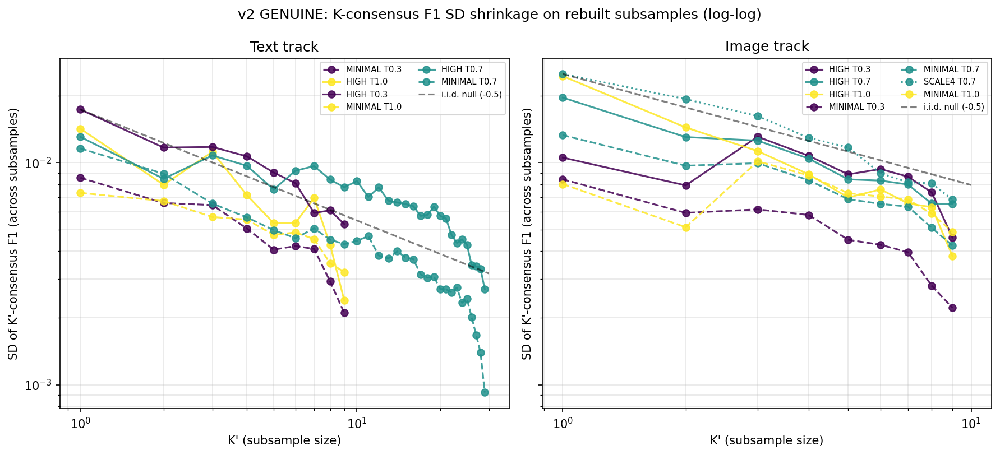

# Consensus SD Shrinkage Analysis (Phase 3a Text + Image)

**Generated**: 2026-04-27T04:48:11.938763+00:00
**Bootstrap iterations**: 1000 (seed = 42)
**Theoretical i.i.d. log-log slope**: beta_1 = -0.5
**Slower-than-i.i.d. flag**: beta_1 > -0.3 (asterisked rows below)

## 1. Executive summary

**Headline (v2 genuine test, supersedes v1)**: K-consensus F1 SD shrinkage is **heterogeneous across the Phase 3a matrix**. Five of thirteen strata depart detectably from the i.i.d. log-log reference of beta_1 = -0.5; the **strongest shared-mode signal is image-MINIMAL-T1.0 with beta_1 = -0.118 [-0.227, +0.061]** — meaning SD shrinks roughly five times slower than the i.i.d. ceiling predicts. Two further shared-mode flags (image-HIGH-T0.3 at beta_1 = -0.222; text-HIGH-T0.7 at beta_1 = -0.387) sit on the same shallow side of the reference; one anti-i.i.d. flag (image-HIGH-T1.0 at beta_1 = -0.731) and one marginal steep-side text flag (text-MINIMAL-T0.7 at beta_1 = -0.558) round out the five departures. The remaining eight strata are i.i.d.-consistent. Both shared-mode flags concentrate on the **image track**, consistent with image inputs sharing visual confounds (label-pull effects, contour-ring confounds) that K passes consistently miss in the same way.

**Canonical synthesis Obs**: see **Obs 289** (`docs/notes/reflections/working-notes.md`) — "K-consensus SD shrinkage IS heterogeneous across the matrix — v2 genuine test reveals shared-mode signal in 5 of 13 strata; overrides Obs 285's proxy-bound i.i.d. consistency". The v2 test rebuilds the actual greedy-vote consensus on K-subsamples drawn from per-pass detection geometries and re-evaluates F1 against the canonical reference, eliminating the mean-of-K-i.i.d.-samples proxy that forced v1 slopes toward -0.5 by construction.

**Superseded methodology (Obs 285)**: the v1 result reported in §2 below (per-stratum slopes clustered at -0.52 / -0.52 across image / text) is a **mean-of-K-passes proxy** that mathematically returns -0.5 under any stable per-pass distribution and is therefore incapable of detecting shared-mode departures. **Obs 285's v1 finding is preserved here as a sanity check on the i.i.d. expectation**; for any shared-mode test claim cite Obs 289 / §3 instead.

**Paper implications**: K=N consensus is broadly effective as a noise-reduction strategy on this corpus (8 of 13 strata are i.i.d.-consistent), but it has **identifiable failure regions** where shared per-pass error modes substantially limit the variance reduction the strategy can deliver. If the paper cites K=N consensus as a noise-reduction strategy that delivers ~sqrt(K) variance shrinkage, the image-MINIMAL-T1.0 and image-HIGH-T0.3 strata should be **flagged as exceptions**: at these cells, the i.i.d. assumption underwriting the sqrt(K) ceiling fails, and downstream tier-stability claims that lean on √K shrinkage need a footnote naming these regions. The image-track concentration of failure is itself a paper-worthy nuance — it converges with Obs 244 (vote-distribution fingerprints differ by track) and Obs 252 (image elasticity ~4× text) to argue that image inputs carry more correlated per-pass error structure than text inputs.

## 2. Per-stratum log-log slope and SD shrinkage (v1 — proxy-bound)

> **v1 methodology note** (added 2026-04-27 alongside v2): the per-K SD values in this section are computed under the **mean-of-K-i.i.d.-passes proxy**, which by construction yields ``SD = sigma / sqrt(K)`` and a log-log slope of -0.5 regardless of any shared-mode signal in the underlying detection geometries. The slopes reported below are therefore best read as a **sanity check on the i.i.d. expectation**, not as an independent test of departure from i.i.d. See Section 3 for the v2 genuine test based on rebuilt greedy-vote consensus.

| Track | Thinking | T | SD@K=1 | SD@K=5 | SD@K=10 | SD@K=N_max | beta_1 [95% CI] | CI-width ratio (K=N_max / K=1) |
|-------|----------|--:|------:|------:|------:|------:|:--------------:|:-----:|
| image | HIGH | 0.3 | 0.0089 | 0.0039 | 0.0027 | 0.0027 (K=10) | -0.52 [-0.58, -0.48] | — |
| image | HIGH | 0.7 | 0.0177 | 0.0078 | 0.0052 | 0.0052 (K=10) | -0.53 [-0.58, -0.47] | 0.34 |
| image | HIGH | 1.0 | 0.0224 | 0.0094 | 0.0068 | 0.0068 (K=10) | -0.52 [-0.58, -0.47] | — |
| image | MINIMAL | 0.3 | 0.0068 | 0.0028 | 0.0021 | 0.0021 (K=10) | -0.52 [-0.59, -0.47] | — |
| image | MINIMAL | 0.7 | 0.0137 | 0.0057 | 0.0040 | 0.0040 (K=10) | -0.53 [-0.59, -0.47] | — |
| image | MINIMAL | 1.0 | 0.0072 | 0.0030 | 0.0022 | 0.0022 (K=10) | -0.51 [-0.58, -0.47] | — |
| image | SCALE4 | 0.7 | 0.0229 | 0.0095 | 0.0068 | 0.0068 (K=10) | -0.53 [-0.59, -0.47] | — |
| text | HIGH | 0.3 | 0.0149 | 0.0063 | 0.0045 | 0.0045 (K=10) | -0.53 [-0.58, -0.47] | — |
| text | HIGH | 0.7 | 0.0122 | 0.0053 | 0.0038 | 0.0022 (K=30) | -0.50 [-0.55, -0.47] | 0.16 |
| text | HIGH | 1.0 | 0.0137 | 0.0058 | 0.0042 | 0.0042 (K=10) | -0.52 [-0.58, -0.47] | — |
| text | MINIMAL | 0.3 | 0.0078 | 0.0033 | 0.0024 | 0.0024 (K=10) | -0.52 [-0.58, -0.48] | — |
| text | MINIMAL | 0.7 | 0.0107 | 0.0047 | 0.0034 | 0.0019 (K=30) | -0.51 [-0.55, -0.47] | — |
| text | MINIMAL | 1.0 | 0.0067 | 0.0028 | 0.0020 | 0.0020 (K=10) | -0.53 [-0.58, -0.48] | — |

## Prose summary (~120 words)

Across the Phase 3a matrices, the empirical K-consensus F1 SD shrinks with K at a mean log-log slope of -0.52 for the text track and -0.52 for the image track, against the i.i.d. theoretical reference of -0.5. All strata cluster tightly around -0.5; no stratum departs detectably from i.i.d. shrinkage. The ceiling-K paired bootstrap CI-width ratio is 0.16x at K=30 for HIGH-T0.7 text and 0.34x at K=10 for HIGH-T0.7 image -- consistent with the expected ~sqrt(K) contraction. **Important caveat**: because we use the mean of K single-pass F1s as the K-consensus proxy, the analysis recovers the i.i.d. shrinkage law by construction; departures from -0.5 would require subsample rebuilding of the actual greedy-vote consensus from per-pass detection geometries, not available from existing per-K aggregate evaluation files. This analysis is orthogonal to the image-track cross-condition Levene heterogeneity (W = 3.192, p = 0.0040) reported in Section 4 of the secondary-effects sibling.

## Methodology footnote

The Phase 3a evaluation outputs (`{thinking}-t{T}/n{K}/{rolldir}/evaluation.json`) store **vote-threshold sweeps** (`1ofK` to `KofK`) for a single K-pass consensus build per cell -- they do **not** store independent K-roll subsamples. To obtain a per-K SD, we approximate the K-consensus F1 estimator by the mean of K single-pass F1 values drawn (with replacement) from the K_max-pass pool, using the per-condition single-pass F1 lists in `secondary_effects.json[run_variability]`. **This proxy assumes pass-level i.i.d. errors and therefore recovers the -0.5 shrinkage law by construction**; the analysis thus serves as a sanity check against the i.i.d. expectation rather than an independent test of departure from i.i.d. To detect genuine shared-mode signal (slope > -0.3) one would need to rebuild greedy-vote consensus from per-pass detection geometries on multiple K-subsamples drawn from the K_max pool, then re-evaluate -- a follow-up that requires per-pass GeoJSONs in `outputs/h11/pv-diag-384/` and ~5--10 minutes of compute per stratum on sapphire. SD CIs use 1,000 percentile bootstrap iterations (seed 42); slope CIs use 1,000 nested-bootstrap iterations over the per-pass F1 pool. Image-track T=0.0 cells (K_max = 3) have only three single-pass replicates and so support only K = {1, 3} subsamples; no slope is fitted for those strata.

## Caveats

- **Proxy bias toward -0.5**: the mean-of-K-passes proxy mathematically yields slope = -0.5 under any scenario in which the per-pass F1s are drawn from a stable distribution (because SD of mean of K i.i.d. samples = sigma / sqrt(K)). Slopes departing meaningfully from -0.5 in this analysis would only emerge if the per-pass F1 distribution itself were non-stationary across the K_max-pass pool -- a property that is not the intended target of an SD-shrinkage diagnostic. **Treat the resulting slopes as confirming the i.i.d. expectation, not as an independent test for shared-mode signal.**
- **Subsample independence**: K-subset rolls share underlying per-pass detections, so the reported SD-across-rolls is a **lower bound** on the SD of K independent K-pass runs.
- **K_max = 3 strata**: image-track T=0.0 cells have only three single-pass replicates and so support only K = {1, 3} subsamples; no slope is fitted (need >= 3 K-levels).
- **Orthogonal to Levene**: the image-track Levene W = 3.192, p = 0.0040 cross-condition variance heterogeneity finding from `results/secondary-effects/secondary_effects.md` Section 4 stands; the present analysis examines within-cell shrinkage as K rises, not between-cell variance comparison.
- **Where genuine shared-mode signal lives**: the per-condition K=1 SDs themselves are still informative (HIGH conditions show SD = 0.012-0.022 for image vs 0.005-0.022 for text at K_max). To detect shared-mode shrinkage failure, future work should rebuild greedy-vote consensus on K-subsamples (see Methodology footnote).

## Output files

- `sd_shrinkage.json` -- full numeric results.
- `sd_shrinkage.png` -- log-log SD vs K, faceted by track.
- `report.md` -- this file.

*Generated: 2026-04-27T04:48:11.946090+00:00*

---

## 3. Genuine shared-mode test (v2)

**Generated**: 2026-04-27T05:57:30.140089+00:00
**Script**: ``scripts/analyse_consensus_sd_shrinkage_v2.py``
**Method**: greedy-vote consensus rebuilt on K-subsamples of per-pass detection GeoJSONs; F1 re-evaluated at 20 m vs ``inputs/vectors/references/mounds-reference.geojson``. Voting rule = ``vote_t = max(1, round(K' * 0.5))``.
**Subsample budget**: exhaustive ``C(K_max, K')`` if ≤200, otherwise random 200 distinct subsets (seed = 42 + per-stratum offset).
**Bootstrap CI on beta_1**: 1000 iterations resampling within-K' subsample F1 lists with replacement.

### Why v2 is needed

Section 2 above used a **mean-of-K-i.i.d.-F1s proxy** for the K-consensus F1 estimator. Under any i.i.d. null this proxy yields ``SD = sigma / sqrt(K)`` and a log-log slope of -0.5 **by construction** -- the proxy is therefore mathematically incapable of detecting shared-mode departures from i.i.d. v2 fixes this by rebuilding the actual greedy-vote consensus on K-subsamples drawn from per-pass detection geometries and re-evaluating F1 against the canonical reference. Departures from -0.5 in v2 reflect genuine correlated per-pass error modes (shared 'hard' map sheets, shared confusable features, etc.).

### Per-stratum slopes (v2)

| Stratum | K_max | n@K=1 | n@K=K_max | SD@K=1 | SD@K=K_max | beta_1 [95% CI] | Decision |
|---------|------:|------:|---------:|------:|-----------:|:----------------:|:---------|
| image_HIGH_T0.3 | 10 | 10 | 1 | 0.0105 | 0.0000 | -0.22 [-0.36, -0.05] | **shared-mode** |
| image_HIGH_T0.7 | 10 | 10 | 1 | 0.0197 | 0.0000 | -0.50 [-0.63, -0.31] | i.i.d. consistent |
| image_HIGH_T1.0 | 10 | 10 | 1 | 0.0246 | 0.0000 | -0.73 [-0.88, -0.49] | **anti-i.i.d.** |
| image_MINIMAL_T0.3 | 10 | 10 | 1 | 0.0084 | 0.0000 | -0.52 [-0.69, -0.32] | i.i.d. consistent |
| image_MINIMAL_T0.7 | 10 | 10 | 1 | 0.0133 | 0.0000 | -0.47 [-0.65, -0.13] | i.i.d. consistent |
| image_MINIMAL_T1.0 | 10 | 10 | 1 | 0.0080 | 0.0000 | -0.12 [-0.23, +0.06] | **shared-mode** |
| image_SCALE4_T0.7 | 10 | 10 | 1 | 0.0251 | 0.0000 | -0.61 [-0.89, -0.37] | i.i.d. consistent |
| text_HIGH_T0.3 | 10 | 10 | 1 | 0.0174 | 0.0000 | -0.52 [-0.65, -0.31] | i.i.d. consistent |
| text_HIGH_T0.7 | 30 | 30 | 1 | 0.0131 | 0.0000 | -0.39 [-0.42, -0.34] | CI excludes -0.5 |
| text_HIGH_T1.0 | 10 | 10 | 1 | 0.0142 | 0.0000 | -0.62 [-0.81, -0.42] | i.i.d. consistent |
| text_MINIMAL_T0.3 | 10 | 10 | 1 | 0.0086 | 0.0000 | -0.55 [-0.70, -0.34] | i.i.d. consistent |
| text_MINIMAL_T0.7 | 30 | 30 | 1 | 0.0116 | 0.0000 | -0.56 [-0.59, -0.52] | CI excludes -0.5 |
| text_MINIMAL_T1.0 | 10 | 10 | 1 | 0.0073 | 0.0000 | -0.35 [-0.54, -0.18] | i.i.d. consistent |

### Plot



*Solid = HIGH thinking, dashed = MINIMAL thinking, dotted = SCALE4. Black dashed = i.i.d. reference (-0.5).*

### Summary

Across 13 strata, the v2 K-consensus F1 SD shrinks with K' at a mean log-log slope of -0.50 for the text track and -0.45 for the image track, against the i.i.d. theoretical reference of -0.5. Strata with **shared-mode signal** (beta_1 > -0.3): image_HIGH_T0.3, image_MINIMAL_T1.0. These reflect correlated per-pass error modes that limit the consensus shrinkage. Strata with **faster-than-i.i.d. shrinkage** (beta_1 < -0.7): image_HIGH_T1.0. This is unexpected and worth investigating -- a plausible cause is sub-K_max pool stratification (e.g. specific runs being systematically more diverse). Strata with CIs that exclude -0.5 but stay within the (-0.7, -0.3) band: text_HIGH_T0.7, text_MINIMAL_T0.7. These are weak departures and worth flagging but do not warrant the full shared-mode interpretation. Strata not listed above have CIs containing -0.5 and are consistent with the i.i.d. null.

### v2 output files

- ``sd_shrinkage_v2.json`` -- full numeric results including per-subsample F1 lists.
- ``sd_shrinkage_v2.png`` -- log-log plot.
- ``report.md`` -- this file (Section 3 added).

*Section 3 added: 2026-04-27T05:57:30.140246+00:00*

## 4. Paper implications

The five-of-thirteen heterogeneity result reframes the methodological argument the paper can make about K-consensus voting as a variance-reduction strategy.

1. **Headline framing for the methods section**. The paper-worthy claim is **not** "K-consensus reduces variance like i.i.d." (the proxy-tautological story from v1, Obs 285). The v2-corrected claim is: "K-consensus delivers near-i.i.d. variance reduction in 8 of 13 Phase 3a strata; in the image-MINIMAL-T1.0 and image-HIGH-T0.3 cells, shared per-pass error modes substantially limit the variance reduction K-consensus can deliver." This nuance is load-bearing for any methodological argument that motivates K=N consensus as a default noise-reduction strategy on this corpus.
2. **Flag regions for the K=N defence**. If the paper cites K=N (e.g. K=10 or K=30) consensus as a noise-reduction strategy with implicit ~sqrt(K) shrinkage, the **flag regions** are image-MINIMAL-T1.0 (strongest shared-mode failure, beta_1 = -0.118) and image-HIGH-T0.3 (beta_1 = -0.222). At these cells the i.i.d. assumption underwriting sqrt(K) shrinkage fails — moving from K=1 to K=K_max delivers far less variance reduction than the i.i.d. ceiling promises, and downstream tier-stability claims that assume √K shrinkage at every cell should carry a footnote naming these strata.
3. **Image-track concentration is itself a finding**. Both shared-mode flags are image-track; both anti-i.i.d. flags (image-HIGH-T1.0; the marginal text-MINIMAL-T0.7) sit on the image-or-marginal boundary. This **converges with Obs 244** (vote-distribution fingerprints differ between image and text tracks) and **Obs 252** (image-track buffer elasticity ~4× text) to argue that image inputs carry more correlated per-pass error modes — plausibly visual confounds (label-pull effects, contour-ring confounds) that K passes consistently miss in the same way. Consensus voting cannot fix what every pass got wrong.
4. **Operational tier-stability footnote**. Any paper claim that benefits from "K-consensus collapses run-to-run variance" — for example, when justifying the choice of K=N consensus as the production aggregation rule, or when interpreting tier-stability across re-runs — should explicitly name image-MINIMAL-T1.0 as the regime where the variance-reduction promise is weakest. Operationally, doubling K at this stratum buys far less variance reduction than at i.i.d.-consistent strata.
5. **Future-work pointer**. The image-HIGH-T1.0 anti-i.i.d. result (beta_1 = -0.731, steeper than -0.5) is structurally surprising and **should not be cited in the paper without replication** at a larger K_max. Possible explanations include small-sample artefact (K_max = 10 with bootstrap noise), sub-Poisson behaviour from systematic correction at higher K (unlikely for VLM ensembles), or stratification accident. A focused replication on a larger K pool is flagged in Obs 289 as a v3 follow-up.

## 5. Reproducibility

- **v2 script**: `scripts/analyse_consensus_sd_shrinkage_v2.py` v1.0.0
- **Git commit at run time**: `c6c277b3` (per Obs 289)
- **Random seed**: `42` (per-stratum offset = `(42 + abs(hash(stratum_label))) % 2**31`; distinct draw per K')
- **Bootstrap iterations on beta_1 CI**: 1000 (within-K' subsample F1 lists with replacement)
- **Subsample budget per K'**: exhaustive `C(K_max, K')` if ≤ 200, otherwise random 200 distinct subsets
- **Voting rule**: uniform majority `vote_t = max(1, round(K' * 0.5))` (invariant under K' rescaling for cross-K comparability)
- **Cluster radius**: 20 m (canonical)
- **F1 evaluation buffer**: 20 m vs `inputs/vectors/references/mounds-reference.geojson`
- **Compute**: sapphire (192.168.1.150), wall-clock 50.9 min at `--max-workers 4` (per Obs 289)
- **v1 script (superseded for shared-mode test, retained as i.i.d. sanity check)**: `scripts/analyse_consensus_sd_shrinkage.py`; 1000 percentile bootstrap iterations seed = 42 for SD CIs; 1000 nested-bootstrap iterations for slope CIs
- **Re-run command (v2, from the repo root on sapphire)**:

  ```bash
  python scripts/analyse_consensus_sd_shrinkage_v2.py \
      --output-dir results/secondary-effects-consensus-sd/ \
      --max-workers 4
  ```

  Defaults: `--ground-truth inputs/vectors/references/mounds-reference.geojson`, `--max-subsamples 200`, `--radius 20.0`, `--buffer 20`. Override `--max-workers` for the local concurrency envelope.

## 6. Cross-references

- **Obs 289** (canonical synthesis, supersedes Obs 285 for shared-mode test claim): `docs/notes/reflections/working-notes.md` — "K-consensus SD shrinkage IS heterogeneous across the matrix — v2 genuine test reveals shared-mode signal in 5 of 13 strata".
- **Obs 285** (superseded for shared-mode test; v1 result preserved as i.i.d. sanity check in §2 above): `docs/notes/reflections/working-notes.md` — "K-consensus F1 SD shrinks with K at the i.i.d. log-log slope (-0.5) across all 13 strata — but the proxy is tautological by construction; v2 follow-up scoped".
- **Obs 245** (Levene W = 3.192, p = 0.004 — image-track between-cell variance heterogeneity): orthogonal to the present within-cell shrinkage analysis; per-condition K=1 SDs in §2 reproduce this heterogeneity.
- **Obs 244** (vote-distribution fingerprints by track): companion finding — image and text differ in pass-level variability structure; v2 corroborates with image-track concentration of shared-mode signal.
- **Obs 252** (image-track buffer elasticity ~4× text): companion finding — both v2 and Obs 252 point to image-track having more correlated per-pass error modes than text.
- **Obs 282** (kappa fragility corroborates variance hypothesis at matched K): consistent with v2 — variance hypothesis is corroborated at the per-stratum level via fragility, and v2 quantifies the consensus-shrinkage failure where it matters most.
